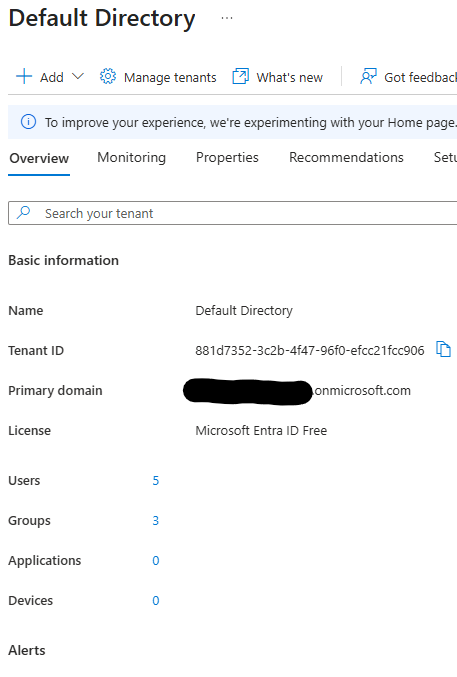
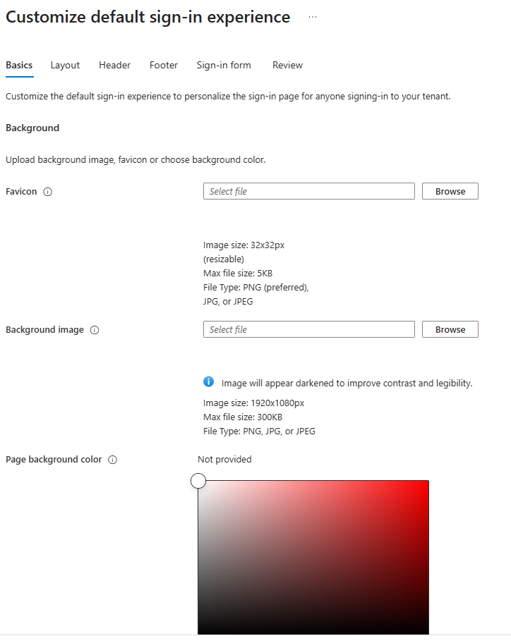
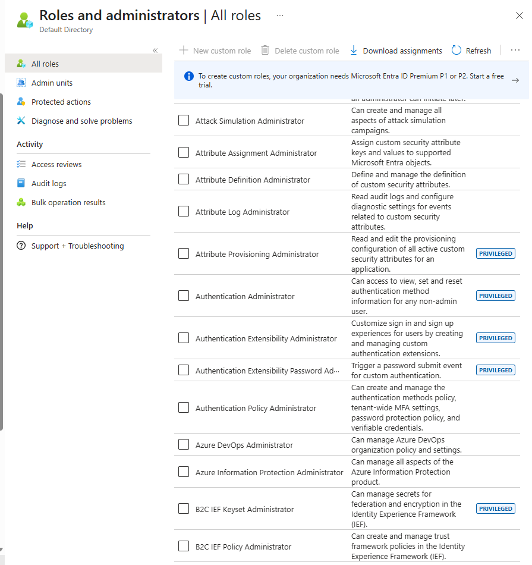
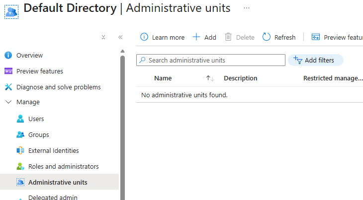
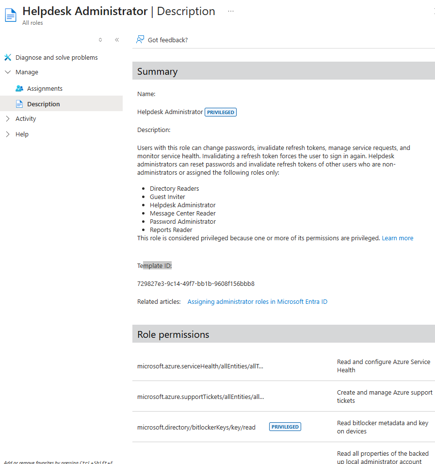
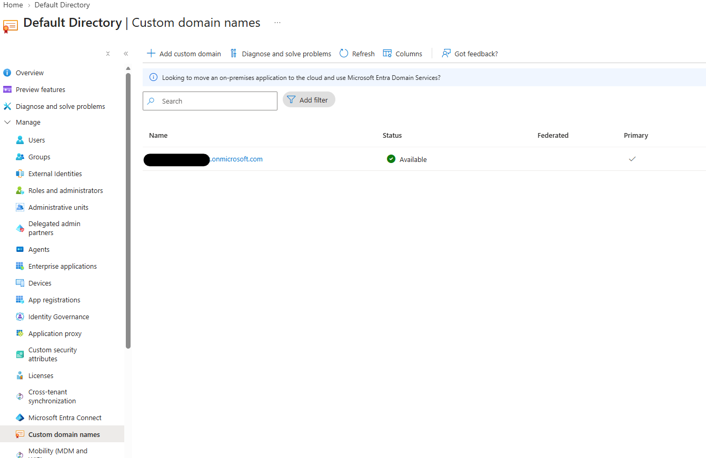
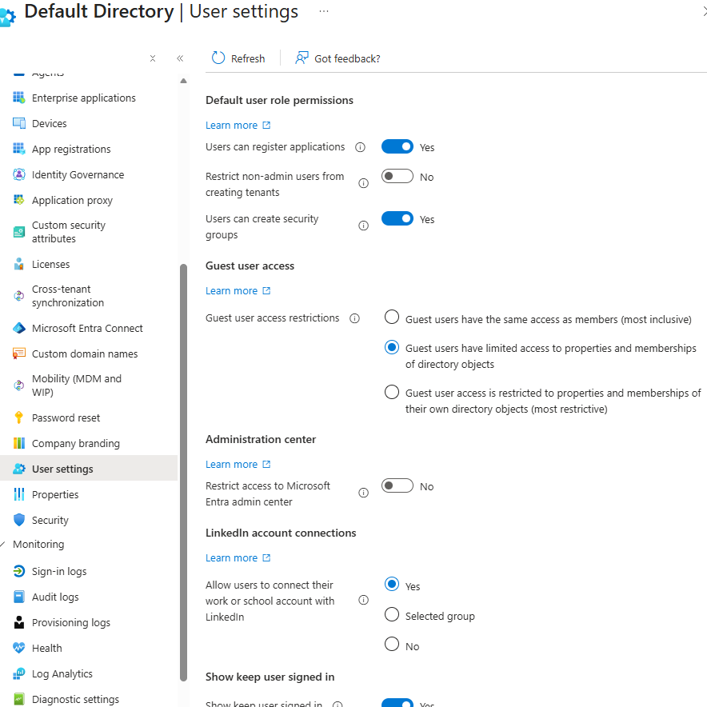

# IAM LABS — Day 1 Lab

# Lab 1 — Entra Identity Administration Foundation

**Date:** September 30, 2026

**Platform:** Microsoft Entra ID

**Environment:** IAM LABS

**SC-300 Focus:** Implement initial configuration of Microsoft Entra ID

---

## Objective

Inspect the existing IAM LABS Microsoft Entra tenant and document its foundational identity-administration configuration.

This lab applies the concepts studied in Microsoft Learn Module 1:

**Implement initial configuration of Microsoft Entra ID**

The lab focuses on:

- Tenant configuration
- Company branding
- Microsoft Entra roles
- Administrative Units
- Role permissions
- Custom domains
- Tenant-wide settings

---

# Part 1 — Tenant Inspection

## Objective

Inspect the Microsoft Entra tenant and establish the baseline identity environment.

## Procedure

1. Open the Microsoft Entra admin center.
2. Open **Microsoft Entra ID**.
3. Open the tenant **Overview** page.
4. Inspect the tenant information.
5. Capture evidence of the tenant configuration.

## Evidence

**Evidence file:** `01-tenant-overview.png`

## Result

The IAM LABS Microsoft Entra tenant was inspected and documented as the baseline environment for the lab series.

---

# Part 2 — Company Branding

## Objective

Inspect the tenant's Microsoft Entra company branding configuration.

## Procedure

1. Open **Microsoft Entra ID**.
2. Open **Company branding**.
3. Inspect the existing branding configuration.
4. Review the available sign-in customization settings.
5. Capture evidence of the current configuration.

## Evidence

**Evidence file:** `02-company-branding.png`

## Result

The existing company branding configuration was inspected and documented.

---

# Part 3 — Microsoft Entra Roles

## Objective

Inspect the Microsoft Entra administrative roles available within the tenant.

## Procedure

1. Open **Microsoft Entra ID**.
2. Open **Roles & admins**.
3. Review the available built-in administrative roles.
4. Identify roles relevant to identity administration.
5. Capture evidence of the available role structure.

## Evidence

**Evidence file:** `03-entra-roles.png`

## Result

The Microsoft Entra administrative role structure was inspected and documented.

The lab reinforced that Microsoft Entra roles determine the administrative capabilities available to an identity.

---

# Part 4 — Administrative Units

## Objective

Inspect the Administrative Units configured within the tenant.

## Procedure

1. Open **Microsoft Entra ID**.
2. Open **Administrative Units**.
3. Inspect the Administrative Units currently present.
4. Review the available administrative scope information.
5. Capture evidence of the current configuration.

## Evidence

**Evidence file:** `04-administrative-units.png`

## Result

The tenant's Administrative Unit configuration was inspected and documented.

The lab reinforced that Administrative Units can be used to establish delegated administrative scope.

---

# Part 5 — Role Permissions

## Objective

Inspect the permissions associated with an administrative role.

## Procedure

1. Open **Microsoft Entra ID**.
2. Open **Roles & admins**.
3. Select an appropriate administrative role.
4. Review the role description and available permissions.
5. Capture evidence of the role permissions.

## Evidence

**Evidence file:** `05-role-permissions.png`

## Result

An Entra administrative role was inspected to understand how role permissions determine the actions an administrator can perform.

This demonstrates the relationship between:

**Role → Permissions → Administrative actions**

The lab also reinforced the principle of **least privilege**.

---

# Part 6 — Custom Domains

## Objective

Inspect the domains configured for the Microsoft Entra tenant.

## Procedure

1. Open **Microsoft Entra ID**.
2. Open **Domain names / Custom domain names**.
3. Review the domains configured in the tenant.
4. Inspect the verification status.
5. Capture evidence of the current configuration.

## Evidence

**Evidence file:** `06-custom-domains.png`

## Result

The tenant's configured domains were inspected and documented.

The lab reinforced that custom domains must be verified before being used for supported identity configuration.

---

# Part 7 — Tenant-Wide Settings

## Objective

Inspect configuration that affects behavior across the Microsoft Entra tenant.

## Procedure

1. Open **Microsoft Entra ID**.
2. Open the available tenant-level settings.
3. Inspect the applicable user and organization-wide configuration.
4. Review the current settings.
5. Capture evidence of the configuration.

## Evidence

**Evidence file:** `07-tenant-wide-settings.png`

## Result

The tenant-wide configuration was inspected and documented.

The lab reinforced that tenant-level settings can affect behavior across the broader Entra environment.

---

# Day 1 Summary

This lab established a baseline understanding of the IAM LABS Microsoft Entra environment.

The following areas were inspected:

- Tenant configuration
- Company branding
- Microsoft Entra roles
- Administrative Units
- Role permissions
- Custom domains
- Tenant-wide settings

## Key SC-300 Concepts Demonstrated

### Administrative Roles

Roles determine **what** administrative actions an identity can perform.

### Administrative Units

Administrative Units can establish **where** delegated administration applies.

### Role Permissions

Permissions define the specific administrative actions available through a role.

### Custom Domains

Verified custom domains allow an organization to use its own domain within Microsoft Entra ID.

### Tenant-Wide Settings

Tenant-wide settings establish configuration that can affect the broader Entra environment.

### Company Branding

Company branding customizes the Microsoft Entra sign-in experience.

---

# Evidence

| Evidence | File |
|---|---|
| Tenant Overview | `01-tenant-overview.png` |
| Company Branding | `02-company-branding.png` |
| Microsoft Entra Roles | `03-entra-roles.png` |
| Administrative Units | `04-administrative-units.png` |
| Role Permissions | `05-role-permissions.png` |
| Custom Domains | `06-custom-domains.png` |
| Tenant-Wide Settings | `07-tenant-wide-settings.png` |

---

# Completion Checklist

- [x] Microsoft Entra tenant inspected
- [x] Tenant evidence captured
- [x] Company branding inspected
- [x] Company branding evidence captured
- [x] Microsoft Entra roles inspected
- [x] Role evidence captured
- [x] Administrative Units inspected
- [x] Administrative Unit evidence captured
- [x] Role permissions inspected
- [x] Role permission evidence captured
- [x] Custom domains inspected
- [x] Custom domain evidence captured
- [x] Tenant-wide settings inspected
- [x] Tenant-wide settings evidence captured
- [x] Evidence uploaded to GitHub

---

# Skills Practiced

- Microsoft Entra ID administration
- Tenant inspection
- Company branding
- Microsoft Entra role administration
- Administrative Units
- Role permissions
- Delegated administration concepts
- Custom domain management
- Tenant-wide configuration
- Identity administration documentation
- Technical evidence collection
