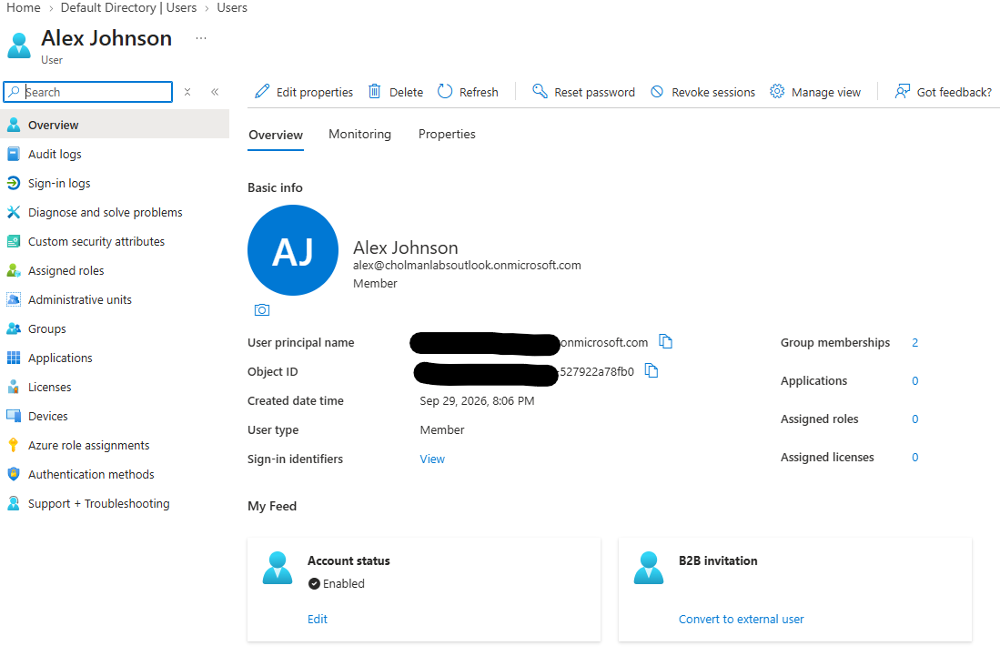
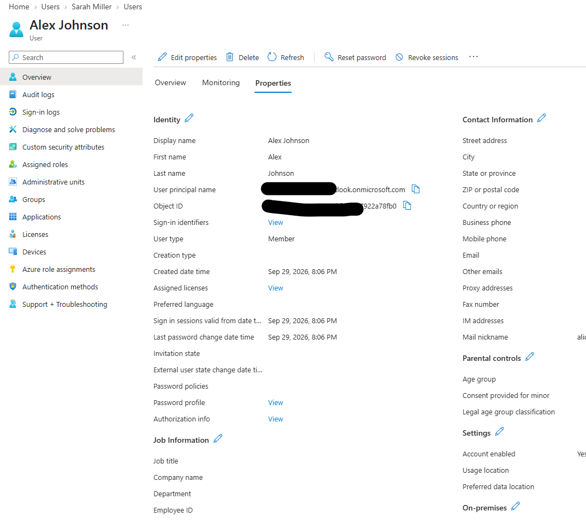
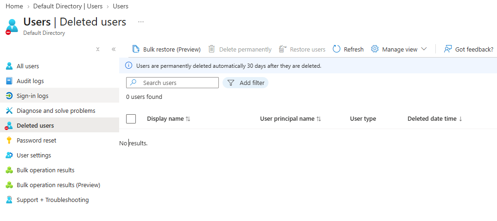
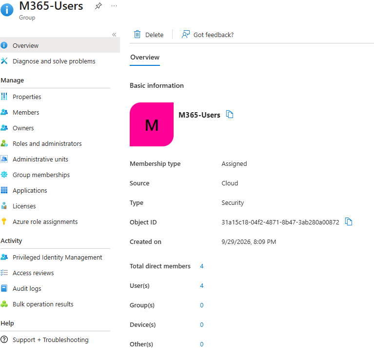
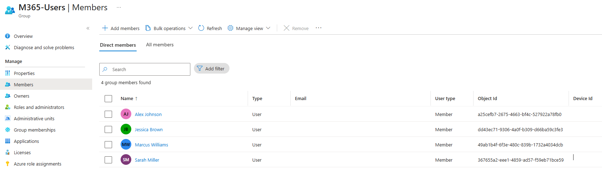
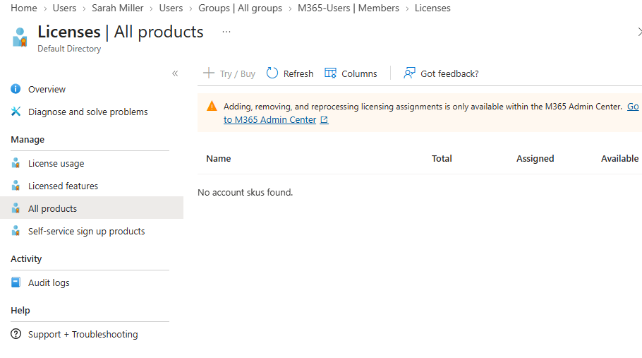
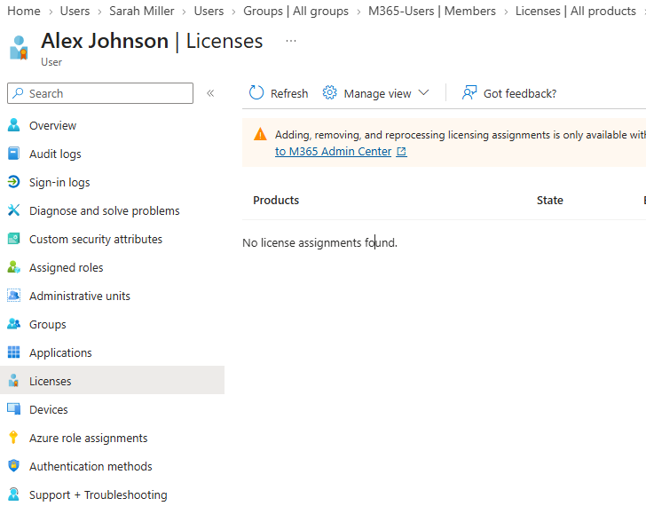
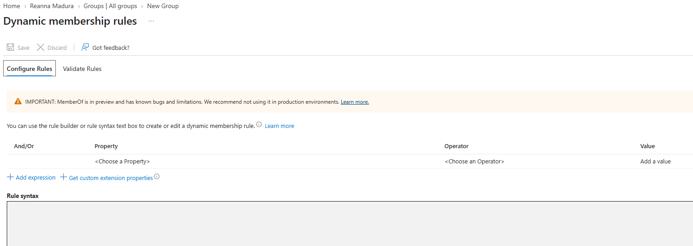
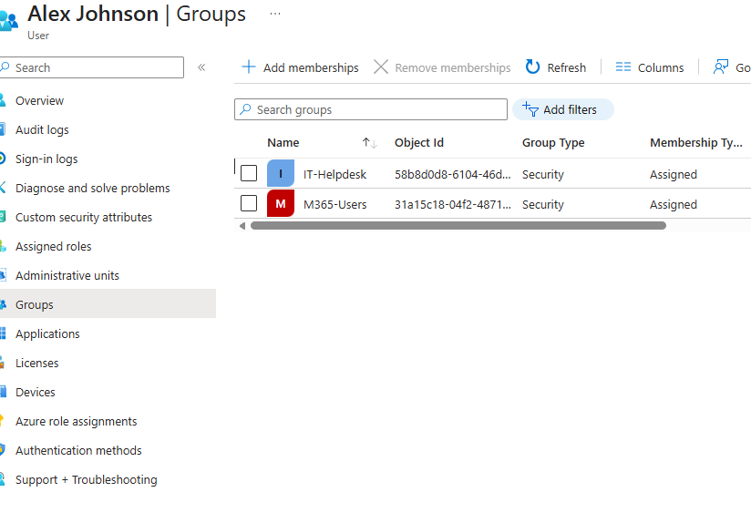

# IAM LABS — Day 2 Lab

## Lab 1 — Users, Groups & Licensing Administration

**Objective:**  
Inspect and document the user, group, membership, and licensing structure of the IAM LABS Microsoft Entra tenant.

**Portfolio title:**

**IAM LABS Week 1 — Users, Groups & Licensing Administration**

---

# Part 1 — User Administration

## Step 1 — Inspect Existing Users

Microsoft Entra ID → Users → All users

The existing users in the IAM LABS tenant were inspected to understand the tenant's current identity structure.

### Evidence

**Screenshot:** `01-user-overview.png`

---

# Part 2 — User Properties & Account Management

## Step 2 — Inspect User Properties

An existing user was opened and the available identity, job, contact, organization, and account properties were reviewed.

No user properties were modified.

### Evidence

**Screenshot:** `02-user-properties.png`

---

# Part 3 — User Lifecycle

## Step 3 — Inspect Deleted Users

The deleted-user management area was inspected to understand where deleted identities are managed and restored.

No existing users were deleted during the lab.

### Evidence

**Screenshot:** `03-deleted-users.png`

---

# Part 4 — Group Administration

## Step 4 — Inspect an Existing Group

An existing Microsoft Entra group was inspected to identify its group type and membership configuration.

The group's membership configuration was reviewed without making changes.

### Evidence

**Screenshot:** `04-group-overview.png`

---

# Part 5 — Group Membership

## Step 5 — Inspect Group Members

The selected group's members were reviewed to understand which identities currently belong to the group.

No members were added or removed.

### Evidence

**Screenshot:** `05-group-membership.png`

---

# Part 6 — Licensing

## Step 6 — Inspect Tenant Licenses

Microsoft Entra licensing was inspected to identify the available license products and their current assignment state.

No licenses were purchased, assigned, or removed during the lab.

### Evidence

**Screenshot:** `06-licenses-overview.png`

---

# Part 7 — User Licensing

## Step 7 — Inspect User Licenses

An existing user was inspected to determine where individual license assignments are managed.

No license assignments were changed.

### Evidence

**Screenshot:** `07-user-licenses.png`

---

# Part 8 — Dynamic Group Membership

## Step 8 — Inspect Dynamic Group Configuration

The Microsoft Entra group creation interface was inspected to understand the available membership types.

Dynamic User membership was reviewed, including the membership-rule configuration interface.

No group was created.

### Evidence

**Screenshot:** `08-dynamic-group-membership.png`

---

# Part 9 — User Group Membership

## Step 9 — Inspect User Group Membership

An existing user's group memberships were inspected to understand the relationship between an individual user and the groups to which they belong.

### Evidence

**Screenshot:** `09-user-group-membership.png`

---

# Day 2 Summary

This lab demonstrated the foundational administration of users, groups, and licensing within Microsoft Entra ID.

The lab covered:

- User administration
- User properties
- User lifecycle
- Deleted-user management
- Group administration
- Group membership
- Group owners and members
- Tenant licensing
- User licensing
- Dynamic group membership
- User-to-group relationships

The lab was performed primarily as an inspection and documentation exercise. Existing identities and groups were used to establish a baseline without making unnecessary configuration changes.

---

# Evidence

| # | Evidence | File |
|---|---|---|
| 1 | User Overview | `01-user-overview.png` |
| 2 | User Properties | `02-user-properties.png` |
| 3 | Deleted Users | `03-deleted-users.png` |
| 4 | Group Overview | `04-group-overview.png` |
| 5 | Group Membership | `05-group-membership.png` |
| 6 | Licenses Overview | `06-licenses-overview.png` |
| 7 | User Licenses | `07-user-licenses.png` |
| 8 | Dynamic Group Membership | `08-dynamic-group-membership.png` |
| 9 | User Group Membership | `09-user-group-membership.png` |

---

# Completion Checklist

- [x] Inspected existing users
- [x] Inspected user properties
- [x] Inspected account status
- [x] Inspected deleted users
- [x] Inspected an existing group
- [x] Inspected group membership
- [x] Inspected tenant licensing
- [x] Inspected user licensing
- [x] Inspected dynamic group membership configuration
- [x] Inspected user group memberships
- [x] Captured evidence screenshots
- [x] Documented the lab

---

# Skills Practiced

- Microsoft Entra ID user administration
- User lifecycle management
- User property management
- Group administration
- Group membership management
- Dynamic group concepts
- Microsoft Entra licensing
- Group-based licensing concepts
- Identity administration
- Technical documentation
- Evidence-based IT administration
