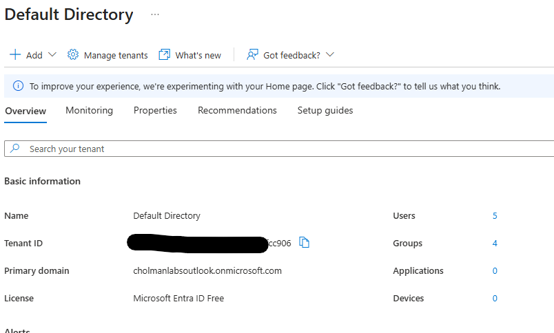
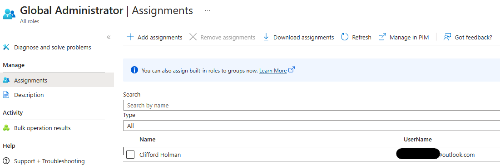
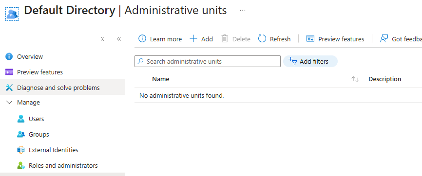
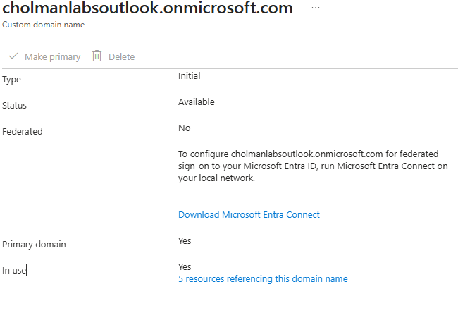
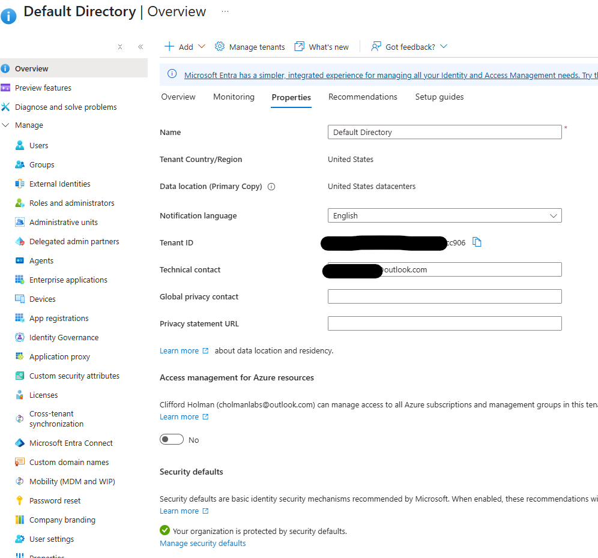
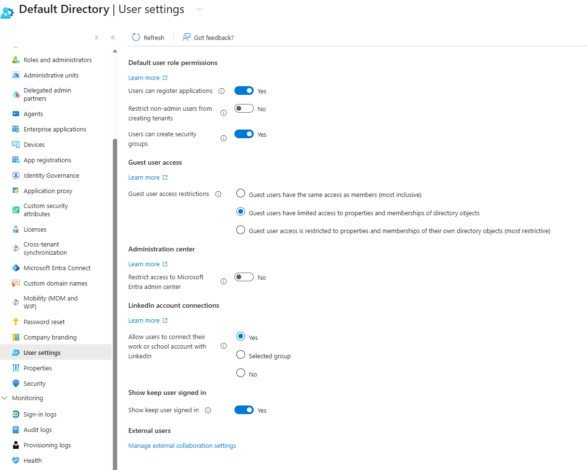

# Tenant Inspection

## Objective

Inspect the IAM LABS Microsoft Entra tenant and document its current identity-administration configuration.

## Environment

- Microsoft Entra ID
- IAM LABS tenant

## Tasks Performed

### Part 1 — Tenant Inspection

- [ ] Reviewed tenant overview
- [ ] Reviewed tenant properties
- [ ] Reviewed custom domains
- [ ] Reviewed tenant-wide settings
- [ ] Reviewed administrative structure

## Findings

### Part 1.1: Tenant Overview

The IAM LABS tenant was inspected to establish a baseline of the current Microsoft Entra identity environment.

The tenant overview was reviewed for:

- Tenant name
- Tenant ID
- Primary domain
- Tenant configuration
- Basic tenant properties

### Evidence

### Validation

The tenant overview was reviewed directly in the Microsoft Entra admin center to confirm the current tenant environment before making administrative changes.

### Part 1.2: Administrative Role Inspection

The Microsoft Entra administrative role structure was reviewed to identify how tenant-level administrative access is assigned.

The **Global Administrator** role was inspected to determine the current assignment structure and identify the principals with the highest level of administrative access.

The review focused on:

- Current Global Administrator assignments
- Assignment type
- Administrative principals
- Existing role configuration

### Evidence

### Validation

### Part 1.3: Administrative Unit Inspection

The tenant's Administrative Units configuration was inspected to determine whether administrative scope had been established for specific subsets of directory objects.

The review focused on:

- Existing Administrative Units
- Administrative Unit membership
- Administrative scope
- Current configuration state

### Evidence

### Validation

The Administrative Units section was reviewed directly in the Microsoft Entra admin center to establish the tenant's current administrative-scoping configuration.

The Global Administrator role was opened in the Microsoft Entra admin center and its assignment information was reviewed directly in the tenant.

### Part 1.4: Custom Domain Inspection

The tenant's custom domain configuration was reviewed to identify the domains currently associated with the Microsoft Entra tenant.

The review focused on:

- Default `onmicrosoft.com` domain
- Configured custom domains
- Domain verification status
- Primary/default domain configuration, where applicable

### Evidence

### Part 1.5: Tenant Properties Inspection

The tenant's properties were reviewed to establish the current organization-level configuration of the Microsoft Entra environment.

The review focused on:

- Organization information
- Tenant-level properties
- Country/region configuration
- Available tenant configuration settings

No configuration changes were made during this inspection.

### Evidence

### Validation

The tenant Properties page was reviewed directly in the Microsoft Entra admin center to verify the current tenant-level configuration.

### Validation

The Custom domain names section was reviewed directly in the Microsoft Entra admin center to verify the tenant's current domain configuration.

### Part 6: Tenant-Wide User Settings Inspection

The tenant-wide User settings were reviewed to establish the current directory-level configuration affecting user behavior and access.

The settings reviewed included:

- Application registration by users
- Security group creation by users
- Guest user access restrictions
- Access to the Microsoft Entra admin center
- LinkedIn account connections
- Keep user signed in behavior
- External user collaboration settings

No configuration changes were made during this inspection.

### Evidence

### Validation

The User settings page was reviewed directly in the Microsoft Entra admin center to verify the current tenant-wide user configuration.
