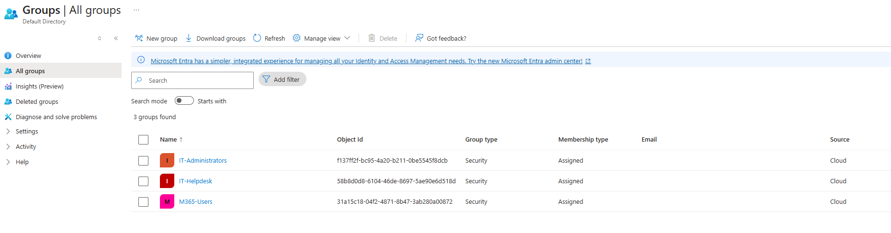

# Groups

## Objective

Verify that the required IAM LABS groups exist and inspect their current Microsoft Entra configuration.

## Groups Reviewed

The following groups were verified in the Microsoft Entra tenant:

- IT-Helpdesk
- IT-Administrators
- M365-Users

All three required groups were present in the tenant.

## Configuration Review

Each group was inspected to review its current:

- Group type
- Membership type
- Description
- Membership
- Available group configuration

No group configuration changes were made during this verification.

## Evidence

## Validation

The groups were reviewed directly through **Microsoft Entra ID → Groups → All groups** to verify that the required IAM LABS groups were present before continuing with subsequent identity-administration tasks.
