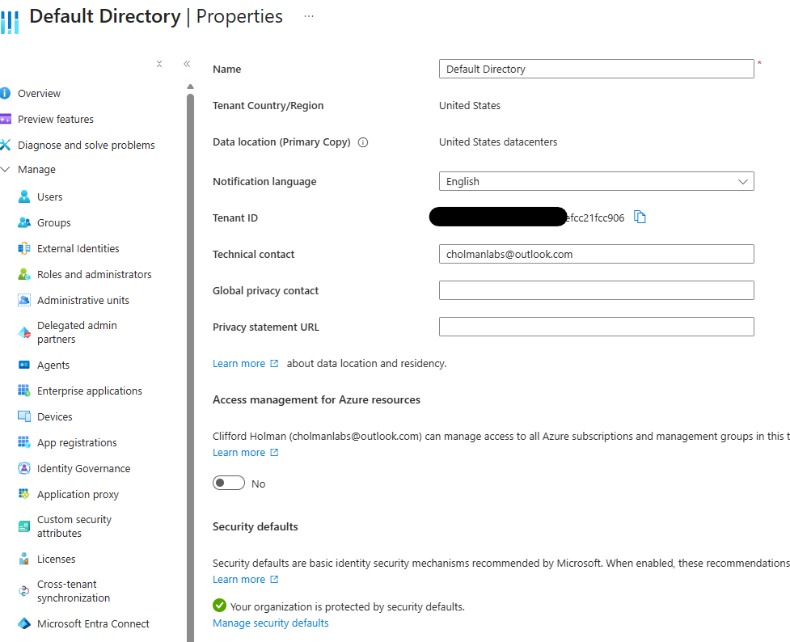

# Lab 1 — Entra Identity Administration Foundation

## Objective

Inspect the existing IAM LABS Microsoft Entra tenant and document its foundational identity-administration configuration.

## Environment

- **Platform:** Microsoft Entra ID
- **Tenant:** IAM LABS
- **Lab:** Week 1 — Lab 1
- **Focus:** Entra identity administration

---

# Part 1 — Tenant Inspection

## 1. Tenant Overview

The Microsoft Entra tenant was inspected to establish a baseline of the IAM LABS identity environment.

### Evidence

### Findings

- Tenant name: **Default Directory**
- Primary domain: **cholmanlabsoutlook.onmicrosoft.com**
- Tenant ID: **Redacted**

---

## 2. Tenant Properties

The tenant properties were inspected to document the organization's basic Microsoft Entra tenant configuration.

### Evidence

### Findings

- Country/region: **United States**
- Other relevant tenant properties: **Tenant ID, Technical Contact, etc.**

---

# Part 2 — Administrative Roles

*To be completed.*

# Part 3 — Administrative Units

*To be completed.*

# Part 4 — Custom Domain

*To be completed.*

# Part 5 — Tenant-Wide Settings

*To be completed.*

---

# Lab Results

*To be completed after all sections of Lab 1 are finished.*

## Skills Demonstrated

- Microsoft Entra tenant administration
- Tenant configuration inspection
- Identity administration
- Microsoft Entra administrative roles
- Administrative units
- Domain configuration
- Tenant-wide identity settings
- Technical documentation
